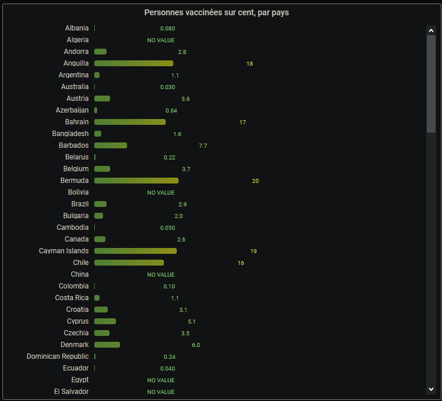

# Brief_Container_Grafana

## Ubuntu - Connexion au serveur Linux :

``# ssh user@10.10.51.151``

-Première connexion,

-Changement du mot de passe,

-Déconnexion automatique,

-Deuxième connexion.

## FileZilla - Création du dossier et transfert des fichiers :

-Insertion de l'hôte (``sftp://10.10.51.151``), de l'identifiant (``user1``) et du mot de passe.

-Insertion du chemin du dossier originel dans ``Site Local`` (``C:\Users\utilisateur\Desktop\Briefs\Brief_Container_Grafana\``),

-Création dossier de réception sur le serveur (``/home/user1/docker/country_vaccinations``),

-Transfert des fichiers ``docker-compose.yaml`` et ``country_vaccinations.sql``.

## Ubuntu - Montage du Docker :

-Déplacement sur le dossier de réception (``cd /home/user1/docker/country_vaccinations``),

-Connexion à Docker (``sudo docker`` suivi du mot de passe Docker),

-Optionel : Installation de docker-compose sur le serveur (``sudo apt install docker-compose``),

-Montage du docker-compose.yaml (``docker-compose up -d``) qui contient :

    version: "2"

    services:
      grafana:
        image: grafana/grafana:latest
        ports:
          - 3000:3000
        user: "root"

      mysql:
        image: mysql:5.7
        ports:
        - "3306:3306"
        environment:
          MYSQL_ROOT_PASSWORD: root
          MYSQL_DATABASE: country_vaccinations
        volumes:
        - ./country_vaccinations.sql:/docker-entrypoint-initdb.d/init.sql
    
Avec les deus services Grafana et MySQL. ``image`` correspond au type de service et à sa version, ``port`` au port utilisé, ``user`` et ``environment`` les renseignements supplémentaires.
    
L'instruction dans ``volumes`` récupère les données du fichier ``country_vaccinations.sql`` et les monte dans le docker MySQL.

## Grafana - Connexion entre les deux Dockers :

-Ouverture sur le navigateur de l'adresse IP du serveur suivi du port Grafana (``http://10.10.51.151:3000``),

-Première connexion Grafana avec identifiant ``admin`` et mot de passe ``admin``,

-Pas de choix de nouvel identifiant et mot de passe (``Skip``),

-Ajout du Docker MySQL dans ``Configuration -> Data Source -> MySQL``, avec :

    -Name = MySQL,
    -Host = country_vaccinations_mysql_1 (le nom du serveur MySQL),
    -Database = country_vaccinations,
    -User = root,
    -Password = root,
    => Save & Test
    
## Grafana - Création des Dashboards :

### Dashboard "Sommes des personnes vaccinées aux Etats-Unis" :

-``Create -> Dashboard -> + Add New Panel``,

-``Edit SQL`` :

    SELECT
      date AS "time",
      people_fully_vaccinated,
      people_vaccinated
    FROM country_vaccinations
    WHERE
      $__timeFilter(date) AND
      country = 'United States'
    ORDER BY date

-Modifications des paramètres d'affichage dans ``Panel`` :

* ``Panel -> Setting -> Panel Title`` = ``Sommes des personnes vaccinées aux Etats-Unis``,

* ``Panel -> Visualisation -> Graph``,
    
* ``Panel -> Display`` => Cocher ``Lines`` et ``Points``.
    
-``Save``.

Résultat :
    

### Dashboard "Personnes vaccinées sur cent, par pays" :
    
-``Edit SQL`` :

    SELECT
      date AS "time",
      country AS metric,
      people_vaccinated_per_hundred
    FROM country_vaccinations
    WHERE
      $__timeFilter(date)
    ORDER BY country
    
-Modifications des paramètres d'affichage dans ``Panel`` :

* ``Panel -> Setting -> Panel Title`` = ``Personnes vaccinées sur cent, par pays``,

* ``Panel -> Visualisation -> Bar Gauges``,
    
* ``Panel -> Display`` - > ``Calculation`` = ``Last (Not Null)``,

* ``Panel -> Display`` - > ``Orientation`` => ``Horizontal``,

* ``Panel -> Display`` - > ``Display Mode`` => ``Gradient``,

-Modifications des paramètres d'affichage dans ``Field`` :

* ``Min`` = 0, ``Max`` = 60,

* ``No Value`` = ``NO VALUE``,

* ``Color Scheme`` = ``Green-Yellow-Red (by value)``.
    
-``Save``.

Résultat :
    
    IMAGE
